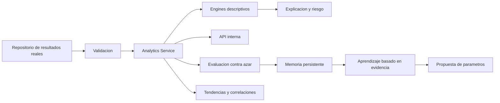

# CORE IA — Arquitectura

El paquete no depende de React Native, Expo, Express ni una base de datos concreta. La aplicacion anfitriona provee resultados historicos mediante una interfaz de datos y consume la API interna adaptandola a HTTP, colas o jobs.

Motores activos: estadisticas/frecuencias, retrasos, tendencias, patrones conjuntos, correlaciones descriptivas, distribuciones, matematico, probabilidad empirica, ranking descriptivo, riesgo de calidad, explicacion, simulacion de ventanas historicas y evaluacion contra linea base aleatoria. `learning/` conserva evidencia de evaluaciones; no ajusta pesos para recomendar numeros.
