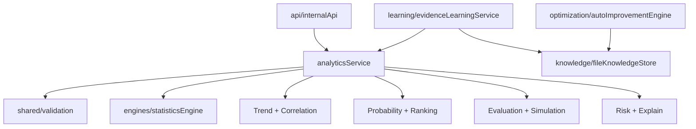

# Diagrama de dependencias

Las flechas siempre apuntan hacia reglas de dominio o interfaces. Ningun modulo depende de Expo, React Native, componentes visuales, Express, ORM o una base de datos concreta.
